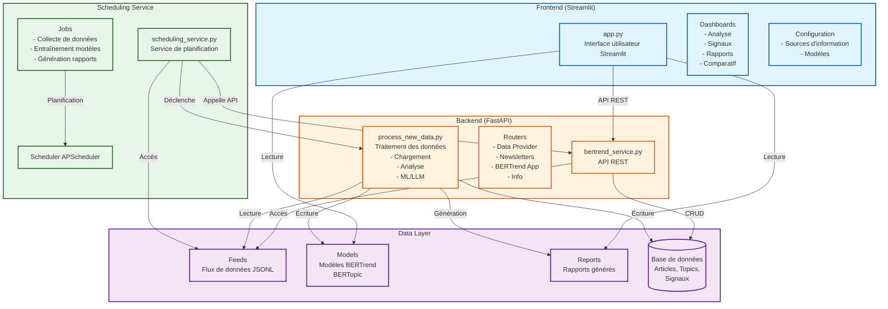

# Architecture simplifiée de prospective_demo

## Description des composants

### Frontend (Streamlit)
- **app.py** : Point d'entrée de l'application Streamlit avec authentification
- **Dashboards** : Interfaces utilisateur pour l'analyse, la visualisation des signaux, génération de rapports et comparaisons
- **Configuration** : Interfaces de configuration des sources de données et des modèles

### Backend (FastAPI)
- **bertrend_service.py** : Service API REST FastAPI principal
- **Routers** : Endpoints pour la gestion des données, newsletters, et applications BERTrend
- **process_new_data.py** : Pipeline de traitement des données incluant ML/LLM

### Data Layer
- **Feeds** : Stockage des flux de données au format JSONL
- **Models** : Stockage des modèles entraînés (BERTrend, BERTopic)
- **Reports** : Rapports générés et analyses
- **Base de données** : Stockage structuré des articles, topics et signaux

### Scheduling Service
- **scheduling_service.py** : Service de planification indépendant
- **Jobs** : Tâches planifiées (collecte, entraînement, génération)
- **Scheduler** : APScheduler pour l'exécution planifiée des tâches
