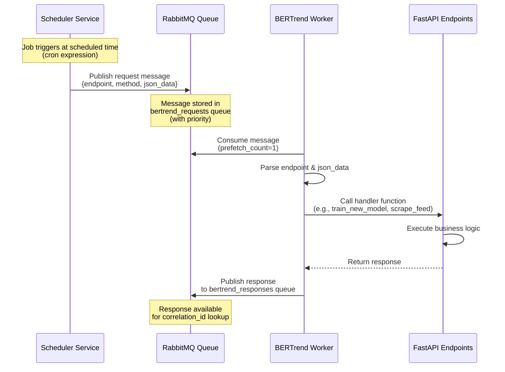
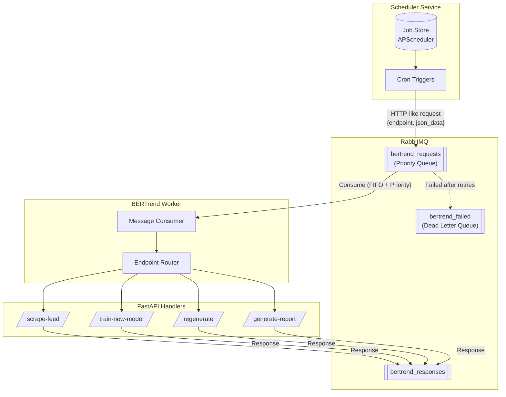

# BERTrend Queue Architecture

This document explains the data flow between the Scheduler Service, RabbitMQ Queue, and BERTrend Service.

## Architecture Overview



## Component Flow Diagram



## Message Format

### Request Message (Scheduler → Queue)

```json
{
  "endpoint": "/train-new-model",
  "method": "POST",
  "json_data": {
    "user": "celine",
    "model_id": "Capitalisées Municipales 2026"
  }
}
```

### Response Message (Worker → Queue)

```json
{
  "status": "success",
  "endpoint": "/train-new-model",
  "response": {
    "status": "success",
    "message": "Successfully trained model..."
  }
}
```

## Key Features

1. **Priority Queue**: Requests can have priority 1-10 (higher = more urgent)
2. **Sequential Processing**: Worker processes one message at a time (prefetch_count=1)
3. **Dead Letter Queue**: Failed messages after max retries go to `bertrend_failed`
4. **Correlation IDs**: Track request-response pairs for async operations
5. **Durable Queues**: Messages survive RabbitMQ restarts
