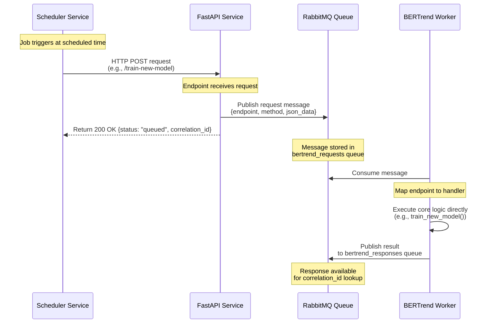
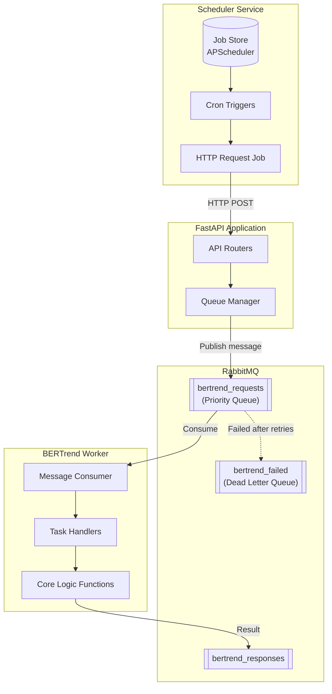

# BERTrend Queue Architecture

This document explains the data flow between the Scheduler Service, FastAPI Application, RabbitMQ Queue, and BERTrend
Worker.

## Architecture Overview

The architecture follows a decoupled asynchronous pattern:
**SchedulerService → FastAPI → RabbitMQ → Worker → Direct Execution**



## Component Flow Diagram



## Data Flow Description

1. **Trigger**: The **Scheduler Service** triggers a job based on a cron expression or interval.
2. **FastAPI Call**: The scheduler executes a `basic_http_request`, sending a POST request to the **FastAPI Application
   **.
3. **Queuing**: The FastAPI endpoint receives the request, generates a `correlation_id`, and uses the `QueueManager` to
   publish the task to the **RabbitMQ** `bertrend_requests` queue.
4. **Acknowledgment**: FastAPI immediately returns a "queued" status and the `correlation_id` back to the scheduler (or
   any other client).
5. **Consumption**: The **BERTrend Worker** consumes the message from the queue.
6. **Direct Execution**: The worker identifies the task via the `endpoint` field and calls the corresponding **Core
   Logic Function** directly (e.g., `train_new_model`, `scrape_feed_from_config`).
7. **Result**: Once processing is complete, the worker publishes the result to the `bertrend_responses` queue,
   associated with the original `correlation_id`.

## Message Format

### Request Message (FastAPI → Queue)

```json
{
  "endpoint": "/train-new-model",
  "method": "POST",
  "json_data": {
    "user": "celine",
    "model_id": "Capitalisées Municipales 2026"
  }
}
```

### Response Message (Worker → Queue)

```json
{
  "status": "success",
  "endpoint": "/train-new-model",
  "response": {
    "status": "success",
    "message": "Successfully trained model..."
  }
}
```

## Key Features

1. **Decoupled Scheduling**: Scheduler doesn't need to know about RabbitMQ; it just makes standard HTTP calls.
2. **Asynchronous Processing**: API endpoints respond instantly while heavy tasks run in the background.
3. **Priority Queue**: Requests can have priority 1-10 (higher = more urgent), set by the FastAPI router.
4. **Sequential Processing**: Workers process messages based on `prefetch_count` (usually 1) to manage resource usage.
5. **Direct Core Execution**: Workers call internal library functions directly, avoiding overhead and potential
   recursive loops with the API.
6. **Dead Letter Queue**: Failed messages after max retries go to `bertrend_failed` for manual inspection.
7. **Correlation IDs**: Track request-response pairs across the asynchronous flow.
8. **Durable Queues**: Messages survive RabbitMQ restarts.
